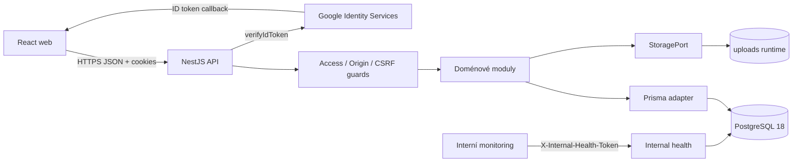

# Přehled architektury

## Monorepo a aplikace

Life Admin je pnpm monorepo se dvěma samostatně sestavitelnými aplikacemi:

- `apps/web` je React single-page application spuštěná a sestavená Vite;
- `apps/api` je NestJS REST API jako modulární monolit.

Kořenové příkazy koordinují vývoj, testy, build, architekturu a dokumentaci.
Web a API sdílejí vývojový životní cyklus, nikoliv runtime proces nebo přímé
importy zdrojového kódu.

Lokální konfigurace má jediný zdroj v kořenovém `.env`. Compose jej načítá
přímo, NestJS a Prisma přes kanonickou cestu a Vite přes kořenový `envDir`.
Důvod a bezpečnostní hranice popisuje
[ADR 0003](../adr/0003-centralized-environment-configuration.md).

## Tok požadavku

Frontend komunikuje výhradně s JSON API. Všechny aplikační requesty posílají
cookies přes `credentials: "include"`; nebezpečné metody přidávají CSRF
hlavičku. Google ID token existuje na frontendu pouze v login callbacku.

## Modulární monolit

API sdílí jednu PostgreSQL databázi a transakční hranici, ale kód je rozdělen na
auth, users, households, documents, tasks, calendar, scheduling, finance, audit
a health moduly. Infrastruktura Prisma a storage je oddělená od aplikačních
služeb. Důvod tohoto rozhodnutí popisuje
[ADR 0001](../adr/0001-modular-monolith.md).

## Data a storage

PostgreSQL je autoritou pro uživatele, domácnosti, členství, relace, dokumentová
metadata, úkoly, kalendář, finance a audit. Lokální PGDATA vzniká v
`database/postgres/`. Dokumentové soubory jsou v ignorovaném `uploads/` a jsou
dostupné pouze přes autentizované endpointy a `StoragePort`; složka se nikdy
nepublikuje staticky.

## Bezpečnostní hranice

- globální access guard je deny-by-default;
- jediným public endpointem je Google login;
- health endpointy vyžadují oddělený interní token;
- session a CSRF jsou oddělené cookies;
- household data vyžadují kontrolu členství a role;
- upload root není staticky publikován;
- browser ani CORS nejsou považovány za autorizační hranici.

Detailní tok je v
[autentizaci a autorizaci](authentication-and-authorization.md) a storage
pravidla ve [storage architektuře](storage.md).
